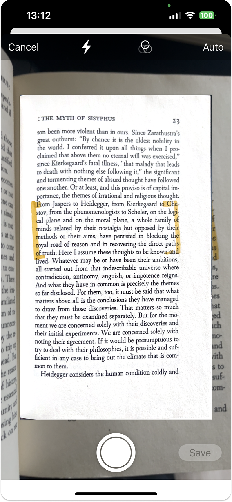
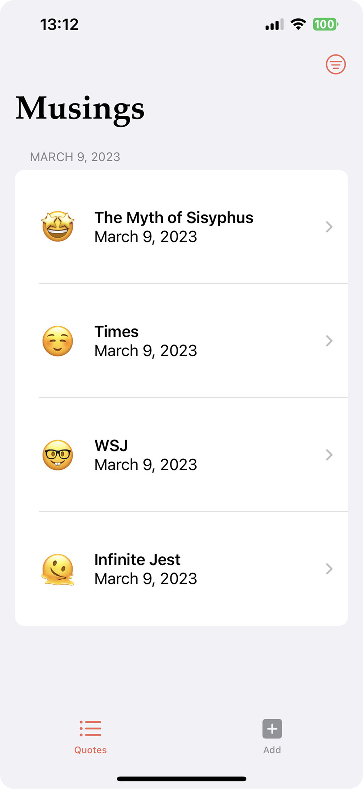
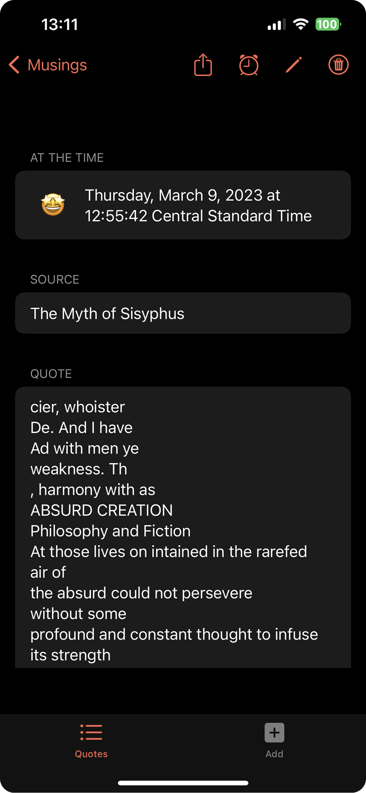

#  Musings

We come across a ton of information everyday but oftentimes can’t be bothered to jot things down. Whether it’s reading or skimming the news, we inevitably find words or passages we want to save or look up later. Writing it down or retyping it is not very efficient, and taking a photo does not help with searching for it. And relying on memory often leads to the struggle of recalling the details hours or days later. Musing was created to solve this problem. Musing leverages VisionKit to extract the information you come across and allows you to get reminders for it later. You can also include notes, or rather your musings, along with the information source. 

## App Features
- Add text snippets manually or using camera to automatically extract 
- Add notes and other information about the information you just encountered
- Set reminder to come back to it
- Edit/Delete entries 
- Share your entries with friends 
- Sort your entries by date and source
- Darkmode supoorted

## Frameworks
*SwiftUI*
For this app I'm using SwiftUI as I find it to be much easier as well as visually aesthetic. The main views the user sees include SplashView, ContentView, MainListView, DetailView, and ScannerView. 

*VisionKit*
https://developer.apple.com/documentation/visionkit
For the scanner feature, I'm using Document scanning feature from VisionKit. For further iternations, I would try incorporating Machine-code and text scanning so user can perform live text scanning.

## Running on Device
Since we're using VisionKit, we will need to test on an actual device. To do so, pair your device to your Mac, and it will appear as an option on Xcode. Once the app is downloaded, you will need to approve an Untrusted Developer (me). 
'Settings -> General -> VPN & DEviceManagement -> Developer App --> Trust'

## Call Outs

- For prompting the user to rate the app, I implemented it via counting changes in phases of the app rather than purely launches.
- Editing an entry creates a new entry, this is a bug that I will fix 
- The reminder is actually set to 5 seconds so it can demonstrate the feature

## Further Developement
There are other features I want to implement for this assignment but could not due to time constraints, but I plan to keep working on them 

- Add Google Books API integration so user can look up their sources and retrieve information such as author and description 
- Add option to take photo and store the photos within entries 
- Add search functionality on MainListView so users can easily search for entries
- Add a profile view where users can further categorize their entries

## Resources 

https://www.hackingwithswift.com/books/ios-swiftui/scheduling-local-notifications
https://stackoverflow.com/questions/64317185/swiftui-how-to-animate-transition-between-two-images-using-a-delay
https://stackoverflow.com/questions/64654677/swiftui-change-images-on-a-timer-with-animation
https://stackoverflow.com/questions/66397828/emoji-keyboard-swiftui
https://levelup.gitconnected.com/using-custom-colors-in-swiftui-d16f07d6a71e#:~:text=You%20need%20to%20create%20a,the%20color%20however%20you%20want.&text=Now%20open%20the%20Inspectors%20tab,to%20modify%20that%20color%20set.
https://www.hackingwithswift.com/books/ios-swiftui/using-an-alert-to-pop-a-navigationlink-programmatically
https://stackoverflow.com/questions/60627957/crossfading-images-in-swiftui-doesnt-seem-to-work
https://www.appcoda.com/swiftui-text-recognition/
https://www.kodeco.com/27201015-dynamic-core-data-with-swiftui-tutorial-for-ios
https://www.youtube.com/watch?v=Ru0bEvYiQ_Q&ab_channel=Recoding
https://developer.apple.com/documentation/visionkit/scanning_data_with_the_camera
https://www.appcoda.com/swiftui-text-recognition/
https://betterprogramming.pub/swiftui-sorting-searching-tagging-elements-like-a-delivery-app-b607fba5ba70
https://www.hackingwithswift.com/forums/swiftui/grouping-atfetchrequest-by-date-and-display-results-in-navigationview/15767
